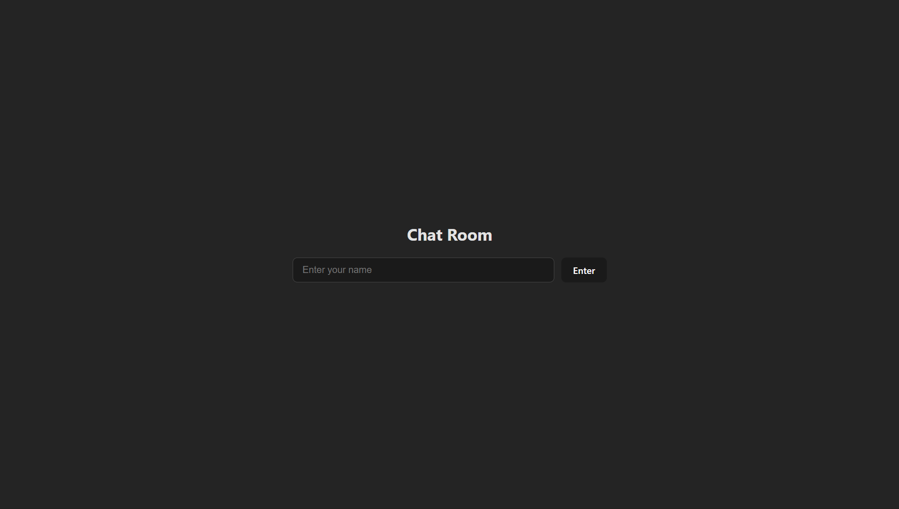
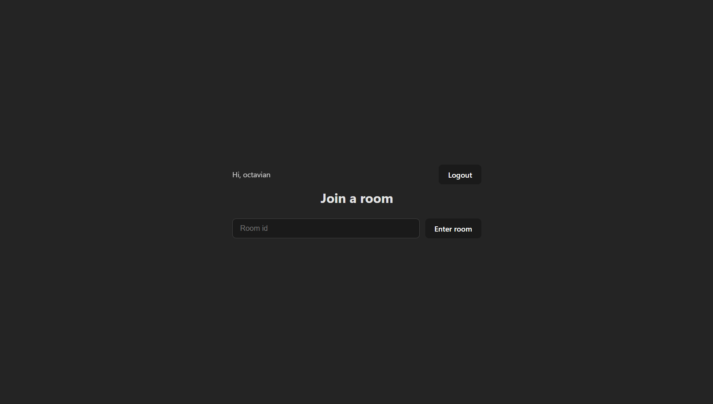
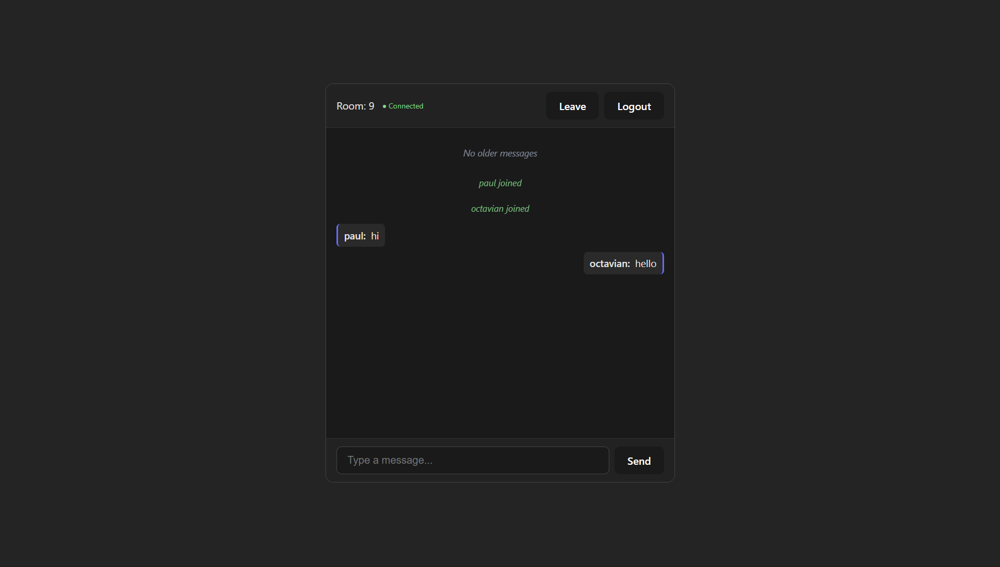

# Chat Room

A full-stack real-time chat application that lets users join rooms and exchange messages instantly—no page refreshes required. Built as a portfolio project to demonstrate full-stack architecture, WebSocket integration, and clean separation of concerns.

---

## Description

**Chat Room** is a live messaging app where users enter their name, pick a room, and start chatting. Messages appear in real time for everyone in the room, and conversation history is available so you can scroll back and read older messages. The experience is designed to feel responsive and modern: connections are persistent, validation is immediate, and errors are surfaced in a clear, user-friendly way.

---

## Visual Gallery

|  |  |  |
|:---:|:---:|:---:|
| **Secure Entry** — Login and username validation with immediate feedback. Form errors and input limits keep the experience safe and predictable. | **The Lobby** — Users see the room selection screen and can navigate between rooms. Logout and room switching are always one click away. | **Live Chatting** — Real-time message feed with connection status, join/leave notifications, and infinite scroll into message history. |

---

## Tech Stack & The Why

| Technology | Role | Learning insight |
|------------|------|------------------|
| **Spring Boot 3** | Backend runtime | Provides a production-ready foundation with embedded server, dependency injection, and auto-configuration—standard in enterprise Java applications. |
| **Spring WebSocket / STOMP** | Real-time messaging | Enables bidirectional, low-latency communication. STOMP over SockJS gives a messaging protocol layer on top of WebSockets, making pub/sub semantics explicit and testable. |
| **Spring Data JPA** | Persistence | Abstracts SQL and provides type-safe repositories. Implemented pagination for message history to avoid loading unbounded data into memory. |
| **H2 (in-memory)** | Database | Keeps setup simple and portable; suitable for demos and development without external DB configuration. |
| **React 19 + Vite** | Frontend | Vite offers fast dev feedback; React handles UI state and component composition. The SPA stays lean with controlled component flow and minimal global state. |
| **@stomp/stompjs + SockJS** | WebSocket client | Mirrors the server’s STOMP setup for compatibility. SockJS provides fallback transport when raw WebSockets are unavailable. |
| **Axios** | HTTP client | Used for REST calls (e.g. paginated message history) with centralized error extraction for consistent UX. |

---

## Core Challenges & Solutions

### 1. Preserving scroll position when loading older messages

**Challenge:** Loading older messages by prepending them to the list would push the viewport down and make users lose their place.

**Solution:** Implemented a `scrollHeightBeforePrepend` ref and a `useLayoutEffect` that runs after messages update. Before the fetch, the current `scrollHeight` is stored; after prepending, the scroll offset is adjusted by the new content height so the visible content stays fixed.

**Result:** Users can scroll up to load more history without the view jumping, matching expected behavior in chat interfaces.

---

### 2. WebSocket lifecycle and connection state

**Challenge:** WebSocket connections need correct setup and teardown, and the UI must reflect connection status (connecting, connected, disconnected, error) and handle disconnects gracefully.

**Solution:** Centralized STOMP client logic in a `useEffect` with proper cleanup: on unmount, the client publishes a leave message (when connected) and calls `deactivate()`. Connection status is tracked in state (`connecting`, `connected`, `disconnected`, `error`) and surfaced in the header. Sending is disabled when not connected, with a clear error message if the user tries anyway.

**Result:** Predictable connection behavior, no duplicate subscriptions on room changes, and clear feedback when the connection fails or drops.

---

### 3. Unified error handling across REST and WebSocket

**Challenge:** REST and WebSocket use different transports, but both need consistent, structured error responses for a good UX.

**Solution:** A `GlobalExceptionHandler` with `@RestControllerAdvice` handles REST exceptions and returns an `ApiError` DTO (status, message, path, optional field errors). For WebSocket, `@MessageExceptionHandler` catches STOMP-level exceptions and returns human-readable error strings. On the client, `getErrorMessage()` in `api.ts` normalizes Axios errors into user-facing messages.

**Result:** Validation and server errors surface consistently whether they come from REST or WebSocket, without exposing raw stack traces.

---

## Engineering Best Practices

- **Modular React structure** — `Login`, `RoomEntry`, and `ChatRoom` are focused components; `App` coordinates flow via `username` and `roomId`. An `ErrorBoundary` wraps screens to contain render failures.
- **RESTful design** — Paginated `/chat/{roomId}` with `pageNumber` and `pageSize`, returning messages in descending order. Clear resource naming and predictable request/response shapes.
- **Exception handling** — Custom exceptions (`InvalidRequestException`, `ResourceNotFoundException`), DTO-based error responses, and separate handling for REST vs WebSocket to keep error flows clean and debuggable.

---

## Quick Start

### Prerequisites

- **Java 21**
- **Node.js 18+** (for npm)
- **Maven 3.6+**

### Backend

```bash
cd server
./mvnw spring-boot:run
```

The API runs on `http://localhost:8081`. H2 console is available at `http://localhost:8081/h2-console` (JDBC URL: `jdbc:h2:mem:chatdb`).

### Frontend

```bash
cd client
npm install
npm run dev
```

The app will be available at `http://localhost:5173` and will proxy `/ws` and `/chat` to the backend.

For a different backend URL, create `client/.env`:

```
VITE_API_BASE_URL=http://localhost:8081
```

### Run both

Start the backend first, then the frontend. Enter a username, choose a room ID, and begin chatting.

---

## Deployment

### Backend with Docker

The backend includes a multi-stage Dockerfile for easy containerized deployment:

```bash
cd server
docker build -t chat-room-server .
docker run -p 8081:8081 chat-room-server
```

The image uses Maven for the build stage and Eclipse Temurin 21 JRE for the runtime, keeping the final image lean. The server listens on port 8081.

### Render.com

This app is deployed on [Render.com](https://render.com). The backend runs as a Web Service (containerized from the Dockerfile), and the frontend is served as a Static Site. Configure the frontend’s `VITE_API_BASE_URL` to point at the deployed backend URL so the app connects to the live API and WebSocket endpoint.
